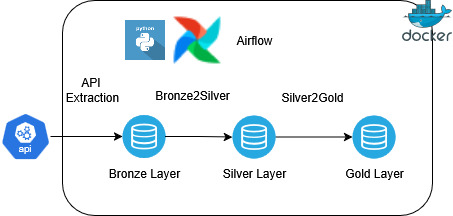
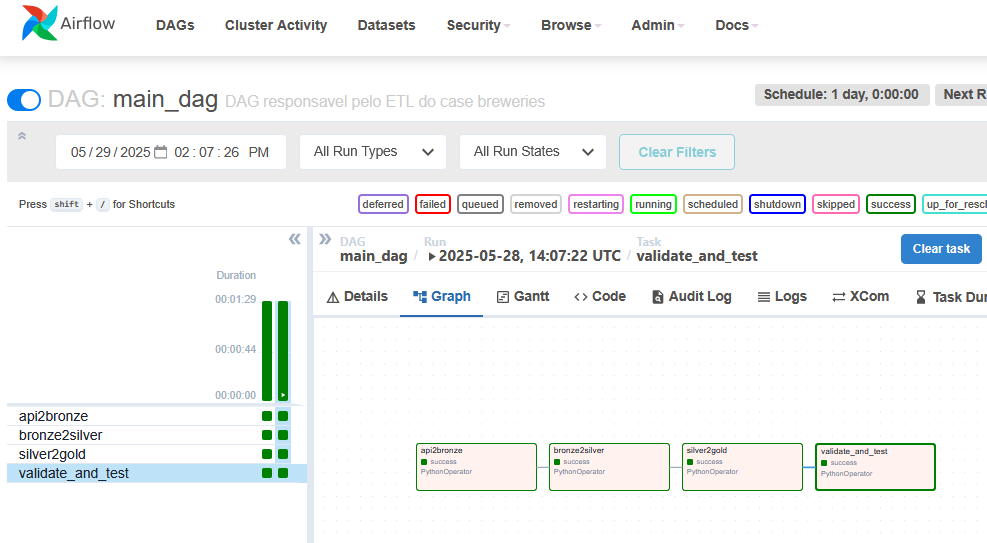

# Breweries
## BEES Data Engineering – Breweries Case

# Overview

This test case was just to show case the ability to provide a simple solution in consuming data from an API, transform, load and aggregate it for, maybe, a future report. 

# Design and Architecture

There are a lot of questions that defines which data architecture should we use in this challenge. First and foremost: Costs and time. This solution needs to be scalable? Is there a great need for processing or a high volume in storage? As we check the API provided in the documentation, "https://api.openbrewerydb.org/v1/breweries", it's possible to verify that we don't have a lot of data to work with. No high volume for storage and there's no need to use spark in this case, as it's overkilling. So our approach is to develop it using python as our programming language, use containers so it's more cloud friendly, we can run it in any VM necessary, and use some kind of library such as pandas or polars for our data engineering tasks, and to simulate our dalake we are using MinIO, and we use Airflow as our orchestrator, as shown in the diagram below.

## Orchestration - Airflow

As we code our different layer, we shall need some kind of tool to orchestrate our tasks in which whaterver way we want. In Azure we can use Azure Data Factory, in Databricks we can use Databricks Workflows. In our approach we used Apache Airflow.

## Data Lake - MinIO

As we are trying to simulate a datalake, we decided to use MinIO because it's quite hand and intuitive to manipulate the buckets overall.

## Programming Language and Data Manipulation

As described in the Design and Architecture Section, we are using python as our main programming language and pandas library, as there's no need to submit a spark environment to handle the volume of data present in the API.

# Data WorkFlow
## Step 1 : Extraction

We are using the requests library to be able to extract all breweries contatined in the API, and we save it as parquet, without any kind of manipulation. This is considered our bronze layer.

## Step 2 - Transformation

As we advance into our Silver Layer, we apply a schema (column names and types) so that any new information from a given API shall be transformed into. This guarantees an extra layer in data quality. In this layer we can multiple transformations, it depends on our business case and rules. We then save it to our silver layer partitioning the data using the brewery location.

## Step 3 - Aggregation

For our next and final layer, we aggregate the data so that the BI tool that shall showcase the data in reports, is not overloaded with transformations and calculations that may slow down a report in real time.

## Step 4 - Validation

This step is an validation of number of rows, number of nulls and schema.

